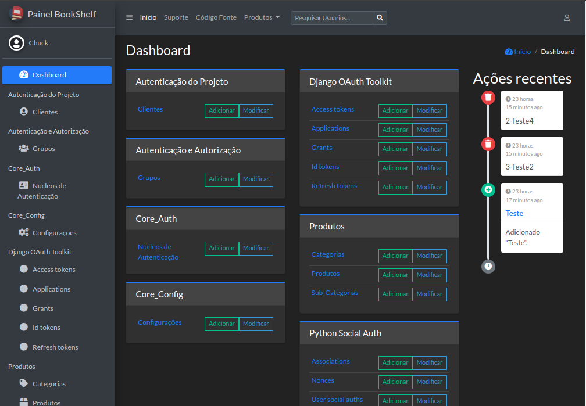

# BookShelf

## História e Objetivo

O projeto  tem como objetivo ser uma aplicação para gestão de produtos, venda e compra de produtos e serviços, bem como a inteligência de armazenamento. A aplicação hoje é feito em Django e segue os principios [REST](https://pt.wikipedia.org/wiki/REST) para que possa ter um front-end agradável futuramente.

## Principais Caracteristicas

- Design Responsivo
- Fácil Entendimento e Adaptação
- Fácil Escalabilidade

## Principais Funcionalidades

- Administração Personalizada (Filtros, Aparência, ações e etc personalizáveis)
- Registro, organização e controle de armazenamento dos produtos
- Registro e controle de serviços
- Controle e registro de vendas de serviços e produtos (Por diversos tipos de usuários)
- Controle e registro de compras de produtos (Somente com autorização prévia)
- Dashboard para controle e análise de dados
- Controle de divulgação externa da plataforma

## Em construção

O projeto iniciou sendo uma maneira de estudos, e hoje esta tomando novas proporções, por isso esta sendo revisto as bases e refatorado para que possa ser usado em diferentes plataformas, por isso ***não esta em processo de produção***

## Visualizando



## Como Inicializar

Caso você não tenha o repositório em seu computador, basta clona-lo na pasta que deseja :

```bash
git clone https://github.com/Chuckpy/book.git
```

## Variaveis de Âmbiente

Com o repositório em seu computador, você precisa incluir na pasta as suas variaveis de ambiente, existe nesse repositório um arquivo de exemplo (.env.example) que pode ser usado da primeira vez que o sistema for usado. Porém para ser reconhecido como variável de ambiente, ele precisa ter o nome alterado para '.env', ***não se esqueça disso***.

### Modelo de Configuração Inicial

O projeto foi desenvolvido de uma maneira que haja um modelo de configuração para o painel administativo, o modelo "[CoreConfig](/src/core/core_config/models.py)" é herdado por boa parte do projeto, como sendo uma configuração padrão. Uma, e apenas uma configuração deve ser mantida ativa, e por isso há um método singleton que impede que várias configurações existam simultâneamente. Caso o projeto esta sendo iniciado pela primeira vez agora, é preciso que em algumas partes do projeto ele seja omitido, ou explicitamente criado.

### Subindo os Contâiners

Feito isso, basta o docker para contruir os containers com o docker-compose:

```bash
docker-compose build
```

Se tudo deu certo até aqui, você pode subir os containers e ver o servidor funcionando com :

```bash
docker-compose up -d
```

### Parabéns

Se chegou até aqui, ***parabéns*** ! Veja em seu servidor local que ele esta funcionando normalmente, clique [AQUI](http://0.0.0.0:8000/) para ver ele funcionando  

### Vamos rodar as migrações

Feito tudo de acordo, as migrações já foram executadas, mas vamos dar continuidade no projeto fazendo as migrações manualmente para teste ( sempre lembando que o nome dos containers pode ser diferente, caso você tenha alterado as variaveis de ambiente )

```bash
docker exec book_shell_app python3 manage.py makemigrations
docker exec book_shell_app python3 manage.py migrate
```

E da mesma maneira você pode acessar o sistema administrativo com um "superusuario", criado facilmente com o comando :

```bash
docker exec open-rest-app_web_1 python3 manage.py createsuperuser
```

E finalmente, derrubar os containers, com o comando :

```bash
docker-compose down
```

## Como contribuir com o projeto

O projeto foi imaginado inicialmente para ser open source, portanto, caso queira apoiar o projeto codando conosco, sinta-se a vontade.
Veja os relatórios e onde pode ajudar em [Questões](https://github.com/Chuckpy/BookShelf/issues)
